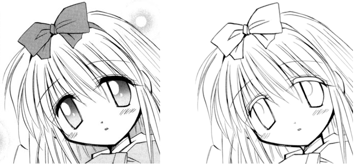

# MangaLineExtraction_PyTorch
The (Official) PyTorch Implementation of the paper ["Deep Extraction of Manga Structural Lines"](https://www.cse.cuhk.edu.hk/~ttwong/papers/linelearn/linelearn.html)

### How to use this model

    model_torch.py [source folder] [output folder]

Example:

    model_torch.py ./pytorchTestCases/ ./pytorchResults/
    
### The model weights

please refer to the release section of this repo.
    
### Requirement

  +  Python3
  +  PyTorch (tested on version 1.9)
  +  Python-opencv

### How the model is prepared

The PyTorch weights are exactly the same as the theano(!) model. I take some efforts to convert the original weights to the new model. Moreover, the functional PyTorch interface allows easier fine-tuning of this model. You can also take the whole model as a sub-module for your own work (e.g., use the on-the-fly extraction of lines as a stuctural constraint).

### About model training

I really don't want to admit, but the legacy code looks like some artworks by a two-year old. I will try my best to recover the code to py3 and share the screentone dataset. This won't take long so please stay tuned. 

### BibTeX:

    @article{li-2017-deep,
        author   = {Chengze Li and Xueting Liu and Tien-Tsin Wong},
        title    = {Deep Extraction of Manga Structural Lines},
        journal  = {ACM Transactions on Graphics (SIGGRAPH 2017 issue)},
        month    = {July},
        year     = {2017},
        volume   = {36},
        number   = {4},
        pages    = {117:1--117:12},
    }

### Credit:

Wenliang Wu, who inspired me to port this great thing to PyTorch

