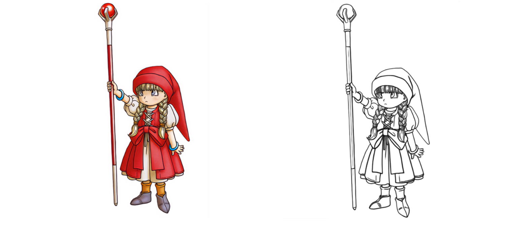

# MangaLineExtraction_PyTorch
The (Official) PyTorch Implementation of the paper ["Deep Extraction of Manga Structural Lines"](https://www.cse.cuhk.edu.hk/~ttwong/papers/linelearn/linelearn.html)

### How to use this model

    model_torch.py [source folder] [output folder]

Example:

    model_torch.py ./pytorchTestCases/ ./pytorchResults/
    
### The model weights (erika.pth)

Please refer to the **release** section of this repo. Alternatively, you may use this link:

    https://www.dropbox.com/s/y8pulix3zs73y62/erika.pth?dl=0
    
### Requirement

  +  Python3
  +  PyTorch (tested on version 1.9)
  +  Python-opencv

### How the model is prepared

The PyTorch weights are exactly the same as the theano(!) model. I make some efforts to convert the original weights to the new model and ensure the overall error is less than 1e-3 over the image range from 0-255. 

Moreover, the functional PyTorch interface allows easier fine-tuning of this model. You can also take the whole model as a sub-module for your own work (e.g., use the on-the-fly extraction of lines as a structural constraint).

### About model training

I really don't want to admit it, but the legacy code looks like some artworks by a two-years old. I will try my best to recover the code to py3 and share the screentone dataset. This won't take long, so please stay tuned. 

### Go beyond manga

Surprisingly, this model works quite well on color cartoons and other nijigen-like images. Simply load the image as grayscale(by default) and check out the results!

### BibTeX:

    @article{li-2017-deep,
        author   = {Chengze Li and Xueting Liu and Tien-Tsin Wong},
        title    = {Deep Extraction of Manga Structural Lines},
        journal  = {ACM Transactions on Graphics (SIGGRAPH 2017 issue)},
        month    = {July},
        year     = {2017},
        volume   = {36},
        number   = {4},
        pages    = {117:1--117:12},
    }

### Credit:

+ Xueting Liu and Tien-Tsin Wong, who contributed this work
+ Wenliang Wu, who inspired me to port this great thing to PyTorch
+ Toda Erika, where the project name comes from

